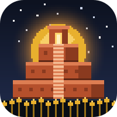
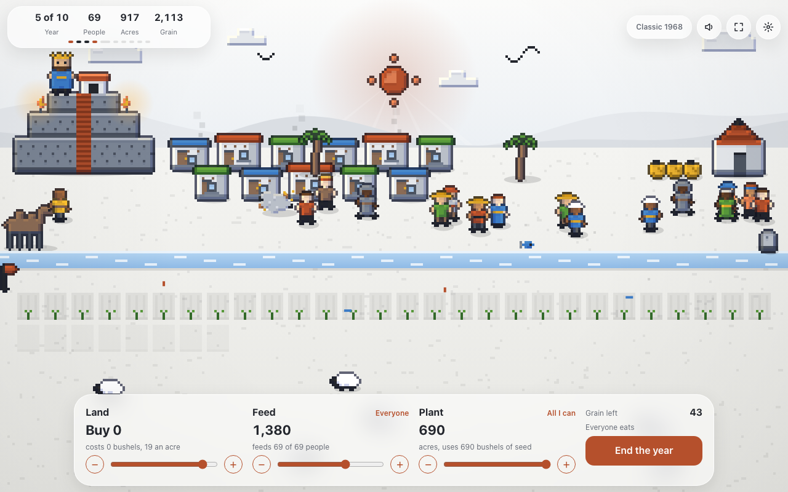

# Hamurabi

  [](https://github.com/nulljosh/hamurabi/actions/workflows/test.yml) [](https://github.com/nulljosh/hamurabi)

**Play it now: [hamurabi.heyitsmejosh.com](https://hamurabi.heyitsmejosh.com)**

Be king for 10 years. Feed your people. Keep your crown.

In 1968 Doug Dyment wrote a game where you rule an old city for ten years. You get 100 people, 1,000 acres and a barn of grain. Each year you choose how much land to buy, how much to feed your people and how much to plant. Then the rats, the harvest and the sickness decide how that went.

This is that game with a city you can watch. It runs in a browser, on a Mac, on an iPhone and in a terminal.



## What's in it

A living city. Every number is on screen as something you can see: houses for people, plots for land, sacks for grain. A good harvest makes the crowd cheer. Rats run at the barn. People you starve leave as ghosts, and their graves stay.

A story. Between harvests, things happen: traders, a flood, a greedy king next door, a woman who reads the stars. Ten events, two choices each, all in plain words.

Three ways to play. A new game has the story and three levels: easy, normal, hard. Classic is the 1968 game with nothing added. Today's game gives everyone the same luck for one day, so you can compare grades.

A robot king. It plays a whole game while you watch, and it earns an A+ in 878 of 1,000 games. Beat it.

Music and sound made by a short program. No recordings. One switch turns it off.

Your game is saved at the start of each year. Nothing leaves your device.

## Play it

On the web, open [hamurabi.heyitsmejosh.com](https://hamurabi.heyitsmejosh.com). The top of the page is the game.

On a Mac or iPhone, build the app:

```
cd app && xcodegen generate && open Hamurabi.xcodeproj
```

Pick the Hamurabi scheme and run it on My Mac or an iPhone simulator. It needs Xcode 26 or newer.

In a terminal:

```
python3 hamurabi.py
```

## Check it

```
python3 hamurabi.py --demo        # 200 games, nothing goes negative, bad orders are refused
python3 ruler.py --golden         # one number for 200 robot games: 639940
node web/play/rules.js            # the web rules give the same number, and the story gives 390695
cd app && xcodebuild test -scheme Hamurabi -destination platform=macOS
node art/qa_web.mjs               # plays whole games in headless Chrome by clicking the real buttons
```

The rules live in three languages: Python, Swift and JavaScript. They share one random number generator, so a seed means the same game everywhere. The two numbers above are how we know. If a port drifts, its number changes and the check fails.

## Benchmarks

The robot king over 1,000 games, seeds 0 to 999:

| Grade | Share |
|---|---|
| A+ | 87.8% |
| B | 5.4% |
| C | 2.0% |
| F | 4.8% |

How fast the rules run on a Mac mini M4:

| Version | Games a second |
|---|---|
| Swift | about 500,000 |
| JavaScript | about 100,000 |
| Python | about 32,000 |

Run them yourself with `python3 ruler.py --bench`, `node web/play/rules.js` and the Swift test `testThousandReignsBenchmark`.

## How it's built

A map of every file: [docs/ARCHITECTURE.md](docs/ARCHITECTURE.md). The rules, why the game is hard and how the robot plays: [WHITEPAPER.md](WHITEPAPER.md). What's next: [roadmap.md](roadmap.md).

The art is code too. `python3 art/build.py` draws every sprite and the icon. `art/make_audio.py` writes the music and the sounds. `art/story.json` holds every word of the story.

## Credits

The idea is older than this code. Mabel Addis and William McKay made The Sumer Game in 1964. Doug Dyment wrote Hamurabi in 1968. David Ahl put it in his book *101 BASIC Computer Games* in 1973, and people typed it into home computers for years.

The rules here are the 1968 rules. The code, the art, the music and the story are new. Nothing is copied from the old versions.

MIT License, copyright 2026 Joshua Trommel. See [LICENSE](LICENSE). Privacy: [PRIVACY.md](PRIVACY.md).
